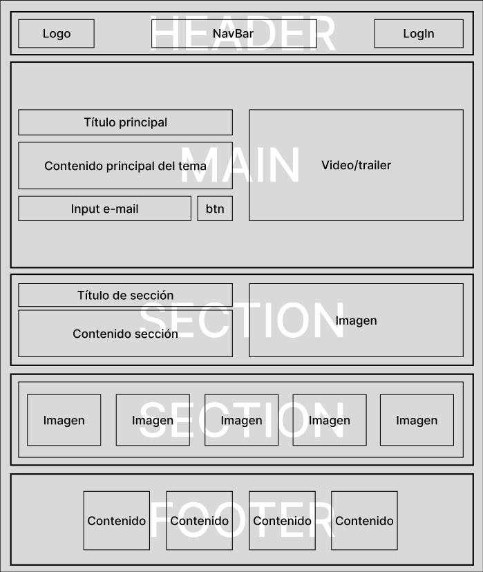

# PROYECTO 3: Landing de negocio.

## Planteamiento

Este proyecto consiste en la creación de una landing page de negocio utilizando `HTML` y `CSS`.

## Prototipado

Se realiza el siguiente prototipado de la página a realizar:

## Requerimientos del proyecto.

### UI

 - Desarrollar prototipado simple.
 - Aplicar en todo el sitio `HTML5`.
 - Aplicar estilos `CSS`.
 - Sección Header.
 - Sección Main.
 - Sección Products.
 - Sección Footer.
 - Opcional. Responsive Web Design (Vista en móviles con uso de media queries).
